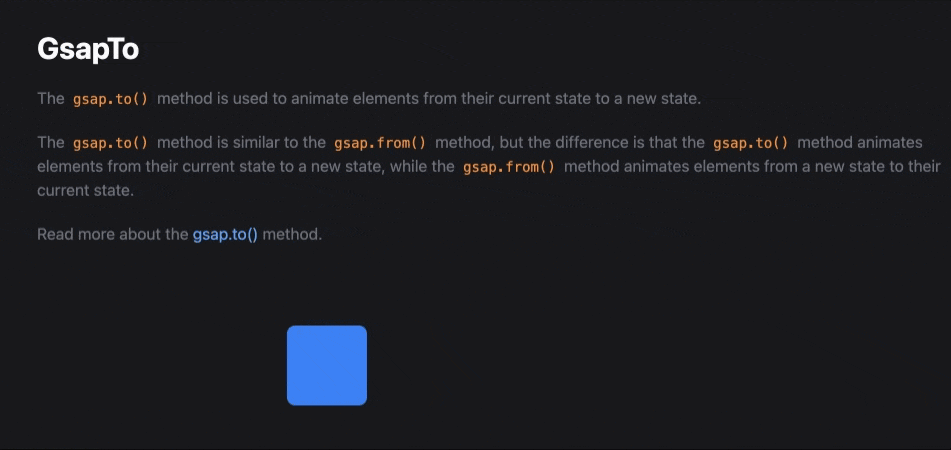
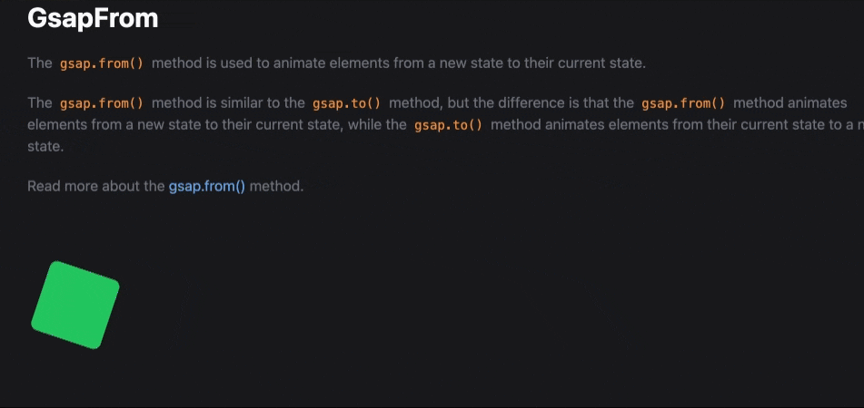
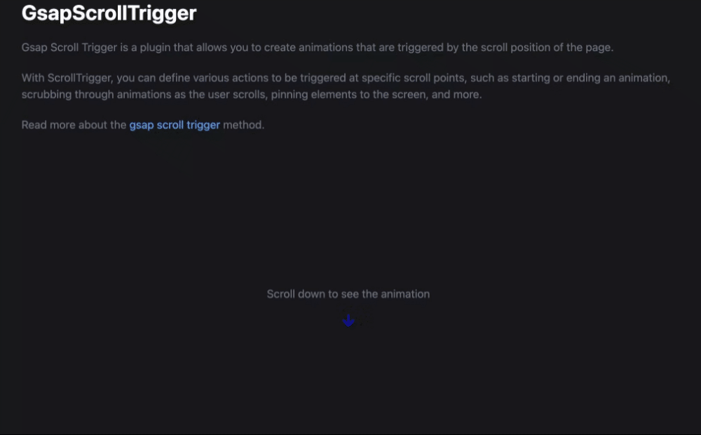

# GSAP Practice Project 🎨💻

This repository is a collection of my learnings and practice projects with **GSAP (GreenSock Animation Platform)**. GSAP is an industry-standard JavaScript library for building high-performance animations, and this project demonstrates various concepts and techniques I've explored.

---

## 🚀 Features

- **Basic Animations**: 
  - Moving elements (`gsap.to` and `gsap.from`).
  - Animating properties like position, scale, rotation, and opacity.
- **Advanced Animations**:
  - Sequenced animations (`gsap.timeline`).
  - Triggering animations based on scroll position (`ScrollTrigger` plugin).
- **Interactive Animations**:
  - Hover and click effects.
  - Dynamic animations based on user interaction.
- **Responsive Animations**:
  - Animations optimized for different screen sizes and devices.

---

## 📚 What I Learned

1. **GSAP Basics**:
   - Setting up GSAP in a project.
   - Using `gsap.to()` and `gsap.from()` to create simple animations.
   - Understanding `duration`, `ease`, and other properties.

2. **Timeline Animations**:
   - Creating complex animations using `gsap.timeline`.
   - Synchronizing multiple animations with precise timing.

3. **Scroll-based Animations**:
   - Leveraging the `ScrollTrigger` plugin to animate elements based on scroll position.

4. **Integration with React**:
   - Using `useRef` to target DOM elements.
   - Managing animations with `useEffect` and the GSAP context API for cleanups.

5. **Debugging and Optimization**:
   - Techniques to debug GSAP animations.
   - Ensuring smooth animations by reducing performance bottlenecks.

---

## 🛠️ Tech Stack

- **Frontend**: React, HTML, CSS, JavaScript
- **Animation Library**: GSAP (GreenSock Animation Platform)

---

## 🖼️ Screenshots

| **Feature**                     | **Screenshot**             |
|----------------------------------|----------------------------|
| GSAP TO                         |  |
| GSAP FROM                       |  |
| Scroll-based Animations         |  |
| Stagger  Effects                |  |

---

## 📂 Project Structure

. ├── public │ └── index.html # Entry HTML file ├── src │ ├── pages │ │ └── GsapTo.jsx # Example with gsap.to() │ │ └── GsapTimeline.jsx # Example with timelines │ ├── App.js # Main app file │ ├── styles.css # CSS styling │ └── index.js # React entry point ├── README.md # Project README └── package.json # Project dependencies

---

## 📦 Installation

1. Clone the repository:
   git clone https://github.com/Vijay-Keshvala/GSAP-Practise.git

2. Navigate to the project directory:
    cd GsapPractice

3. Install dependencies:
    npm install
    npm install gsap
    npm i @gsap/react

4. Start the development server:
    npm run dev

🧑‍💻 Usage
Open the project in your browser at http://localhost:5173.
Explore the different components and animations.
Modify or add new animations to see them in action.

🌟 Acknowledgments
GSAP Official Documentation
React Documentation
